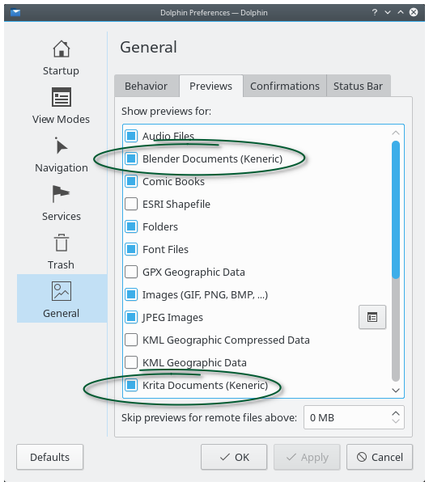
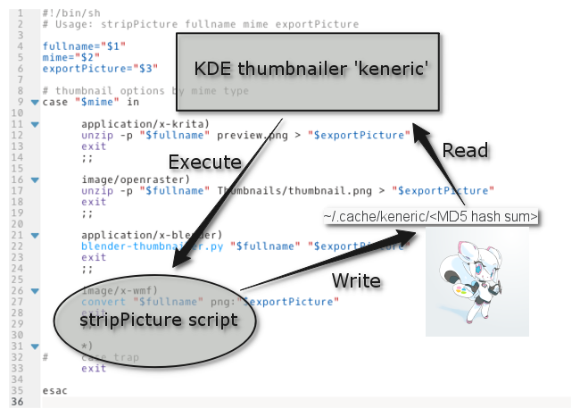
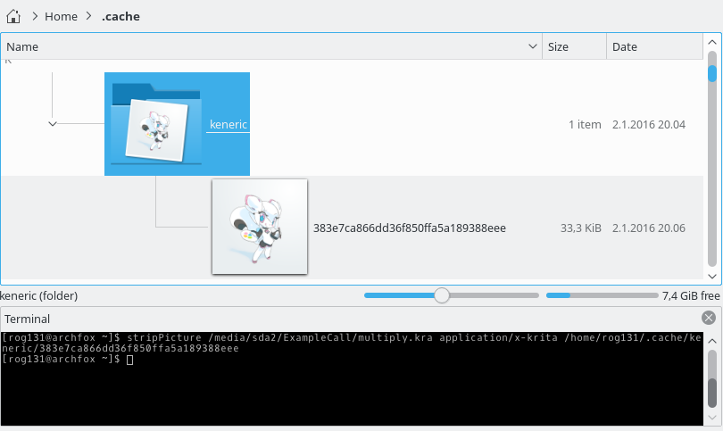
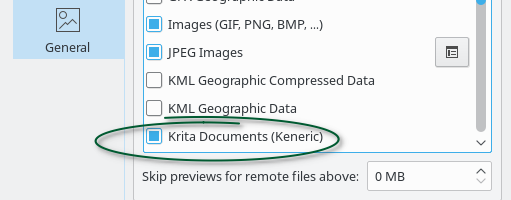
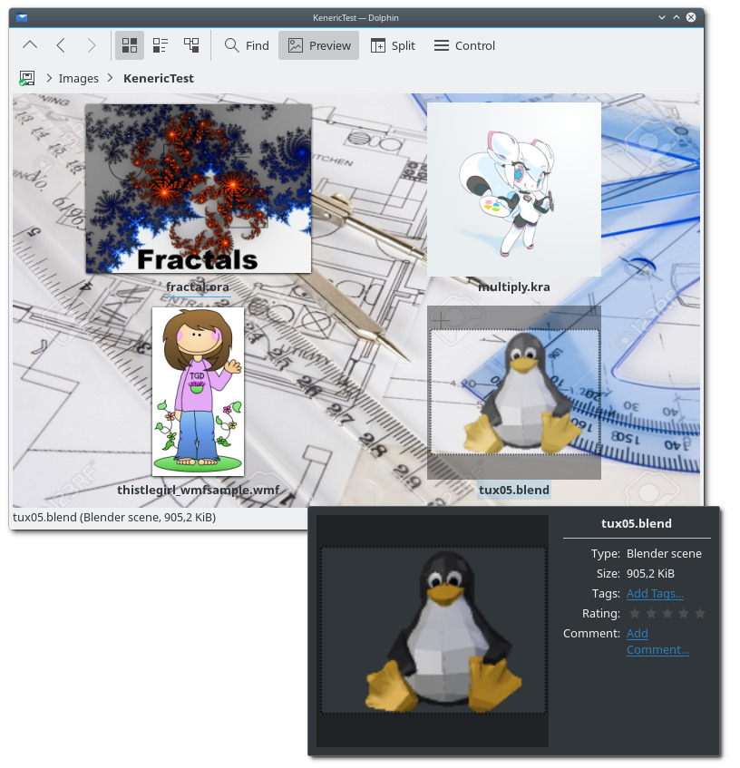

This is a port of keneric, a generic thumbnailer, to KDE 6.

The original README.md is below, with some minor changes. It is outdated.

Keneric ReadMe
==============



* * *

Contents
--------

*   [Description](#description)
*   [Generic compilation](#generic)
*   [Examples](#example)
*   [More notes](#weaseling)
*   [This #### is not working](#shit)

* * *

[\[top\]](#top)

Description
-----------

The Keneric KDE thumbnailer is a generic thumbnailer. It is intended to be used when there is no dedicated KDE thumbnailer and there is a fast and simple way to get the thumbnail image (oneliner).

The Keneric thumbnailer plugin is using a simple script to strip the thumbnail image from the file so the plugin can 'thumbnail' the picture.



The picture file in the `~/.cache/keneric` directory can be any Qt supported [/Reading and Writing Image Files/](http://doc.qt.io/qt-5/qimage.html#reading-and-writing-image-files) format - PNG, JPG, GIF, etc.

### StripPicture

The 'keneric' thumbnailer plugin is executing 'kenericProcess' with arguments:

1.  Name of the thumbnailed file with full path
2.  Mime type
3.  MD5 hash of the #1 with full path where to save the picture

Example call:

```
$ kenericProcess /media/sda2/ExampleCall/multiply.kra application/x-krita /home/rog131/.cache/keneric/383e7ca866dd36f850ffa5a189388eee
```

The thumbnail plugin is making the `~/.cache/keneric` directory if it doesn't exist.

* * *

[\[top\]](#top)

Generic compilation
-------------------

The compilation is depending:

*   cmake
*   extra-cmake-modules
*   kio (kio-dev)

The generic compilation:

```
cd keneric
mkdir builddir
cd builddir && cmake .. -DCMAKE\_INSTALL\_PREFIX=$(kf5-config --prefix) -DCMAKE\_BUILD\_TYPE=Release -DKDE\_INSTALL\_USE\_QT\_SYS\_PATHS=ON
sudo make install
```

Compilation example: [http://pastebin.com/WUhtNru4](http://pastebin.com/WUhtNru4)

* * *

[\[top\]](#top)

Examples
--------

### Krita document files .kra .ora

Both the .kra [/Krita wiki/](https://en.wikipedia.org/wiki/Krita) and the .ora [/OpenRaster wiki/](https://en.wikipedia.org/wiki/OpenRaster) are saving the thumbnail image to the image file. The thumbnail can be extracted with the unzip [/moritzmolch/](http://moritzmolch.com/1749). KDE Forums: [/Dolphin preview for .Kra .Ora and .Psd files/](https://forum.kde.org/viewtopic.php?f=223&t=129633)

Editing `./keneric/scripts/kenericProcess`:

```
#!/bin/sh
# Usage: kenericProcess fullname mime exportPicture

fullname="$1"
mime="$2"
exportPicture="$3"

# thumbnail options by mime type
case "$mime" in

      application/x-krita)
      unzip -p "$fullname" preview.png > "$exportPicture"
      exit
      ;;
      
      image/openraster)
      unzip -p "$fullname" Thumbnails/thumbnail.png > "$exportPicture"
      exit
      ;;

      \*)
#     case trap
      exit
      
esac
```

Making sure that the kenericProcess is executable and copying it to the /usr/local/bin/.

Testing the kenericProcess script.

Making ~/.cache/keneric/ and executing in Konsole: kenericProcess /path/to/the/image.kra application/x-krita /where/to/save/name.

$ kenericProcess /media/sda2/ExampleCall/multiply.kra application/x-krita /home/rog131/.cache/keneric/383e7ca866dd36f850ffa5a189388eee

In testing the thumbnail name be can any string but the plugin is using MD5 hash as unique name.



There should be ~/.cache/keneric/name or error messages. Removing the ~/.cache/keneric/.

Editing `./keneric/desktop/kenericTemplate.desktop`:

```
[Desktop Entry]
Type=Service
Name=Krita Documents (Keneric)
Name\[x-test\]=xxKrita Documentsxx

X-KDE-ServiceTypes=ThumbCreator
MimeType=application/x-krita;image/openraster;

X-KDE-Library=keneric
CacheThumbnail=true
```

Copying the desktop file to `~/.local/share/kservices5/kenerickrita.desktop`.

More of the desktop file options can be found from the KF5 thumbnailer api page: [/ThumbCreator Class Reference/](http://api.kde.org/frameworks-api/frameworks5-apidocs/kio/html/classThumbCreator.html).

Enabling the thumbnailer from the Dolphin settings:



Testing - working at here.

### Blender document files .blend

The Blender [/Blender wiki/](http://wiki.blender.org) is adding a preview image in to the .blend file: [/Blender thumbnail preview/](http://wiki.blender.org/index.php/Dev:Source/Development/Projects/Blender_File_Format/Thumbnail_Previews). The python script is part of the Blender or can be downloaded from [/blender-thumbnailer.py/](https://developer.blender.org/diffusion/B/browse/master/release/bin/blender-thumbnailer.py) or/and [/blender-thumbnailer.py/](https://github.com/dfelinto/blender/blob/master/release/bin/blender-thumbnailer.py).

To extract the preview image:

```
$ blender-thumbnailer.py
```

Expected 2 arguments input.blend output.png

Editing `/usr/local/bin/kenericProcess`:

```
#!/bin/sh
# Usage: kenericProcess fullname mime exportPicture

fullname="$1"
mime="$2"
exportPicture="$3"

# thumbnail options by mime type
case "$mime" in

      application/x-krita)
      unzip -p "$fullname" preview.png > "$exportPicture"
      exit
      ;;
      
      image/openraster)
      unzip -p "$fullname" Thumbnails/thumbnail.png > "$exportPicture"
      exit
      ;;
      
      application/x-blender)
      blender-thumbnailer.py "$fullname" "$exportPicture"
      exit
      ;;

      \*)
#     case trap
      exit
      
esac
```

Testing the kenericProcess.

Adding the desktop file to `~/.local/share/kservices5/kenericblend.desktop`:

```
[Desktop Entry]
Type=Service
Name=Blender Documents (Keneric)
Name\[x-test\]=xxBlender Documentsxx

X-KDE-ServiceTypes=ThumbCreator
MimeType=application/x-blender;

X-KDE-Library=keneric
CacheThumbnail=true
```

### Windows metafiles .wmf

Windows metafiles [/Windows Metafile wiki/](https://en.wikipedia.org/wiki/Windows_Metafile): 'Windows Metafiles are intended to be portable between applications and may contain both vector graphics and bitmap components. It acts in a similar manner to SVG files.' Windows metafiles can be converted by the ImageMagick [/ImageMagick/](http://www.imagemagick.org/script/index.php) to the other formats.

Editing `/usr/local/bin/kenericProcess`:

```
#!/bin/sh
# Usage: kenericProcess fullname mime exportPicture

fullname="$1"
mime="$2"
exportPicture="$3"

# thumbnail options by mime type
case "$mime" in

      application/x-krita)
      unzip -p "$fullname" preview.png > "$exportPicture"
      exit
      ;;
      
      image/openraster)
      unzip -p "$fullname" Thumbnails/thumbnail.png > "$exportPicture"
      exit
      ;;
      
      application/x-blender)
      blender-thumbnailer.py "$fullname" "$exportPicture"
      exit
      ;;

      image/x-wmf)
      convert "$fullname" png:"$exportPicture"
      exit
      ;;
      
      \*)
#     case trap
      exit
      
esac
```

Testing the kenericProcess.

Adding the desktop file to `~/.local/share/kservices5/kenericwmf.desktop`:

```
[Desktop Entry]
Type=Service
Name=Windws Metafile (Keneric)
Name\[x-test\]=xxWindws Metafilexx

X-KDE-ServiceTypes=ThumbCreator
MimeType=image/x-wmf;

X-KDE-Library=keneric
CacheThumbnail=true
```

Testing all...



Working at here.

* * *

[\[top\]](#top)

More notes
----------

Krita sample file from: [/Krita Free Painting App Tutorial/](http://tysontan.tumblr.com/post/91061435966/krita-free-painting-app-tutorial).

OpenRaster sample file from: [/OpenRaster and OpenDocument/](http://www.advogato.org/person/AlanHorkan/diary/366.html).

Blender sample from: [/demo-files/](https://www.blender.org/download/demo-files/).

Windows Metafile sample from: [/WMF Information and samples/](https://www.thistlegirldesigns.com/wmfinfo.htm).

There are lot of thumbnailer scripts available - search engines are your friends...

* * *

[\[top\]](#top)

This #### is not working
------------------------

Test your kenericProcess with the terminal. If the kenericProcess script is not working then the thumbnailer won't work.

After you edit the desktop files execute the 'kbuildsycoca5 --noincremental' to rebuild the system configuration cache.

[\[top\]](#top)
